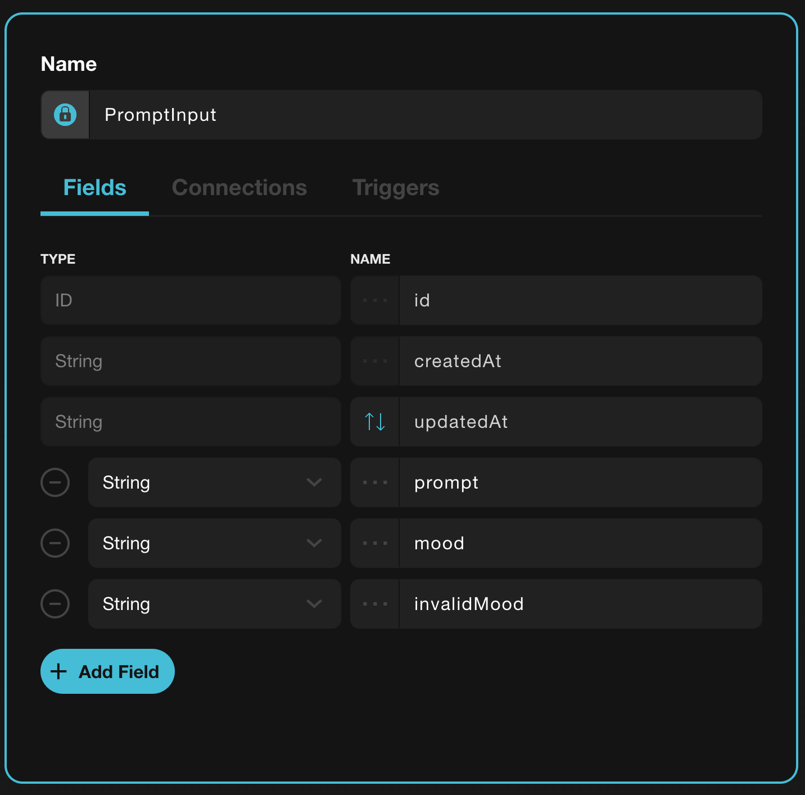
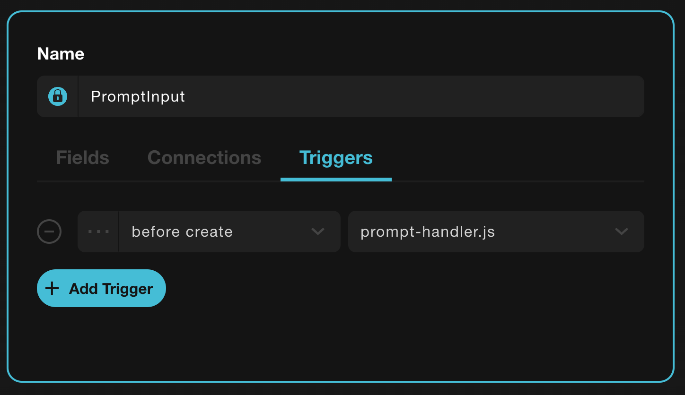

# Creating a cloud function that integrates with OpenAI

## Complete the following steps

1. Sign up to graph**api**® @ [https://my.graphapi.com/signup](https://my.graphapi.com/signup)
2. Create an OpenAI API [https://platform.openai.com/overview](https://platform.openai.com/overview)
3. Get an OpenAI API Key
4. Create .env file with content "OPENAI_API_KEY=<YOUR-API-KEY>"
5. Run `npm i`
6. Run `npm test && npm run build` to verify that the cloud function is working locally and building it
7. In GraphApi create an Object Type with following fields:
   
8. Upload the `prompt-handler.js` file to Graphapi.com in the `Functions` tab.
9. Setup the `prompt-handler` as a "before create" trigger.
   
10. Publish an api

Now whenever you create a new PromptInput, provide just the `prompt` field. The `mood` field will be filled automatically.

```
prompt: string
mood: string
invalidMood: string;
```

## Open Source at GraphApi.io

Read our Code of Conduct at [https://graphapi-io.github.io/](https://graphapi-io.github.io/)

## Links

- graph**api**® [Terms of Service](https://graphapi.com/terms)
- graph**api**® [Privacy Policy](https://graphapi.com/privacy)
- graph**api**® [Data Processing Agreement](https://graphapi.com/dpa)
