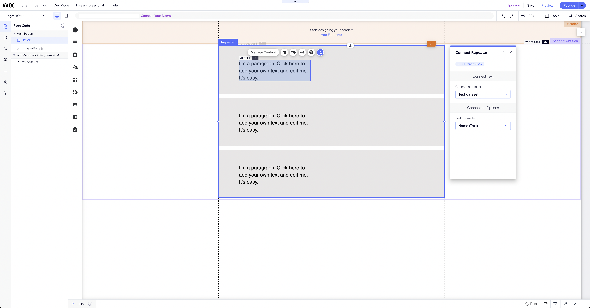
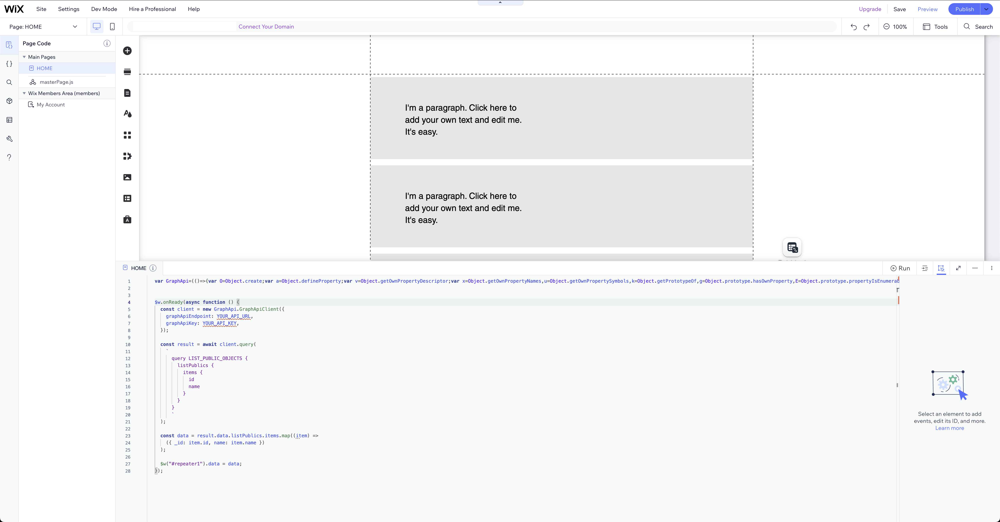

# Wix integration with GraphApi

To show public data from GraphApi inside the Wix page, try the following steps:

## Step 1: Create a GraphApi

As described in here: https://graphapi.com/docs/setup-wizard/

## Step 2: Make sure that the Object type is public


## Step 3: Find your GraphApi url

As described in here: https://graphapi.com/docs/integration/#obtaining-graphapi-url

## Step 4: Create a dedicated Api Key

As described in here: https://graphapi.com/docs/integration/#obtaining-graphapi-api-key

## Step 5: Create a repeater on the wix page


## Step 6: Add text to the repeater


## Step 7: Create a dataset with proper format

The data set should have a similar format to the one in GraphApi, but it doesn't have to be identical. We will map the values anyway.

## Step 8: Bind dataset fields to the text



## Step 8: Copy the script

Copy the script from 'api-client/dist/graphapi-client.min.js'.

## Step 9: Inject the script

Add the following snippet to the wix page javascript file.

```
// Paste the graphapi.client.min.js content here

$w.onReady(async function () {
  const client = new GraphApi.GraphApiClient({
    graphApiEndpoint: YOUR_API_URL,
    graphApiKey: YOUR_API_KEY,
  });

  const result = await client.query(
    `
      query LIST_PUBLIC_OBJECTS {
        listPublics {
          items {
            id
            name
          }
        }
      }
      `
  );

  const data = result.data.listPublics.items.map((item) =>
    ({ _id: item.id, name: item.name })
  );

  $w("#repeater1").data = data;
});
```



That's it! Save and publish the page. If the data is matching your GraphApi schema, you should see a list in the browser.
